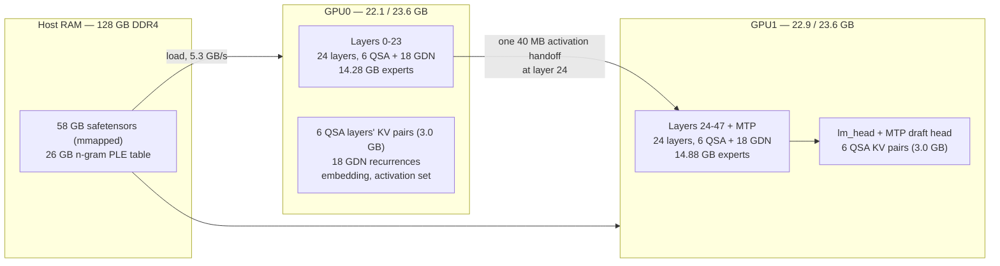

# Helios — a Qwen3.8-Flash-Next inference engine for 2× RTX 3090

A from-scratch C++20/CUDA inference engine for **Qwen3.8-Flash-Next in EXL3 format (2.05 bpw)**,
written for a two-card workstation where the model does not fit in VRAM. No PyTorch, no Python, no
inference framework: the forward pass, the quantization kernels, the KV cache, the multi-token
prediction head and the HTTP server are all in this repository.

```
16k-token prompt          : prefill 2437.7 tok/s
8k context, greedy decode : 63.97 tok/s single, 64.59 tok/s with MTP
context                   : 262,144 tokens, the model's native window
```

Against **exllamav3** serving the same checkpoint on the same machine:

| metric | Helios | exllamav3 | ratio |
|---|---|---|---|
| prefill | **2437.7 tok/s** | 1910 tok/s | **1.28×** |
| decode, 8k context | **64.0 tok/s** | ~60 tok/s | **1.07×** |
| context | 262,144 | 262,144 | parity |
| KV precision at 262k | **fp16** | cq3 (3-bit) | — |

Context is **parity, not a win**: both engines reach the model's native 262,144-token window. The
real difference is the third row — Helios reaches it with an fp16 KV cache, while exllamav3 needs
`CACHE_QUANT=3` to fit the same window on this hardware.

---

## Reference system

The numbers in this README were measured on the machine below — hardware specification only, since
that is what the design decisions depend on:

| component | specification |
|---|---|
| GPUs | 2× NVIDIA RTX 3090, GA102, `sm_86`, 24 GB each, **no NVLink** |
| PCIe | asymmetric: one card on **PCIe 4.0 ×16** (~25 GB/s host↔device), one on **×4** (~3.4 GB/s) |
| CPU | AMD Ryzen 7 3700X, 8 cores / 16 threads, AVX2 only (**no AVX-512, no VNNI**) |
| RAM | 128 GB DDR4-3200, ~27 GB/s measured read bandwidth |
| Software | Linux, CUDA 13.0, GCC 13, CMake + Ninja |

Unlike the sibling [helios-glm53flash](https://github.com/neron82/helios-glm53flash), which streams
85 GB of experts from a 73 GB pinned arena because its model does not fit at all, **this model fits
on the two cards** (58.4 GB of weights, 29.2 GB of expert slabs). So the engine is built around a
layer-pipeline across the PCIe link rather than around streaming: see [Design](#design).

## The model

Qwen3.8-Flash-Next (`qwen4_exp`) as configured in this checkpoint:

| | |
|---|---|
| layers | 48 trunk + 1 MTP draft layer |
| layout | 12 × (3 × Gated DeltaNet → MoE, then 1 × Qwen Sparse Attention → MoE) |
| attention | **Qwen Sparse Attention** (24 Q heads / 2 KV heads, head_dim 256, partial RoPE ×0.25) on 12 layers, with an MQA indexer selecting blocks above 2051 tokens |
| linear attention | **Gated DeltaNet** — channelwise-decay linear attention, 16 QK / 48 V heads, head_dim 128, conv k=4 — on 36 layers |
| MoE | **all 48 layers**: 512 routed experts, **top-10**, intermediate 640, plus 1 shared expert. There is **no dense stem** |
| cross-layer mixing | **Gated Residual** — 4 branches, bottleneck rank 320 (not Sinkhorn mHC) |
| n-gram PLE | a 20M-row trigram table, **26.2 GB**, mmapped, run as a layer ahead of index 1 |
| quantization | EXL3 v1.4.4 trellis: **2-bit** routed experts and indexer, 4-bit attention / GDN / shared expert / `lm_head`, 3-bit MTP projections; embedding and norms bf16 |
| context | `max_position_embeddings` = **262,144** |
| weights on disk | 58.36 GB across 7 safetensors shards (+ the 26.2 GB n-gram file) |

**Every layer is MoE**, and with 512 experts of intermediate 640 the expert weights are wide and
shallow rather than narrow and deep. There is a 27-block vision encoder in the shards; this engine
does not load it.

## Design



**The engine is a layer pipeline, not a model split.** The whole trunk is duplicated across both
cards — 24 layers each, each with its own copy of the mixer, its own activation set and its own
expert set — and the only cross-card traffic is **one 40 MB activation handoff** at the split
(`HELIOS_PIPELINE=0` disables it). Embedding goes to card 0; `lm_head` and the MTP draft head go to
card 1, so the token that comes out of the model never travels back across the link.

Both cards end up at ~22.5 GB of 23.6 GB, so this configuration genuinely needs both cards almost
exclusively. It also means the two halves are independent work: a profile that stalls one half shows
up as a stall in the other.

The n-gram PLE table is 26.2 GB — larger than a card — so it is **mmapped from host RAM** and read on
demand rather than resident.

## Features

- **262,144-token context**, the model's full native window, on 2× 24 GB, with an **fp16** KV cache.
- **Multi-token prediction (speculative decoding)**, on by default, with a draft head that taps the
  trunk's pre-collapse activation stream rather than re-reading the KV cache. Measured **+13.1%**
  greedy decode (see [MTP](#multi-token-prediction) — and read the caveat).
- **Cross-request prefix caching** (`HELIOS_PREFIX_CACHE=1`): a re-sent prompt resumes from the
  newest matching snapshot instead of prefilling from token 0. Measured **6.6×** on an 8810-token
  prompt; snapshots live in pinned *host* memory, so they cost no VRAM.
- **Gated DeltaNet recurrence** in both a serial and a chunked (WY representation) form, with a
  recurrent-state snapshot/rollback path for speculative verification.
- **Qwen Sparse Attention** with a pooled block indexer, plus tensor-core prefill scoring.
- **OpenAI-compatible HTTP server**: `/health`, `/v1/models`, `/v1/completions`,
  `/v1/chat/completions` including SSE streaming with separate `reasoning_content` deltas,
  `/metrics`. Chat template auto-detected from the checkpoint's `chat_template.jinja`.
- **Custom CUDA kernels throughout**: the EXL3 trellis decode and grouped MoE, the QSA decode and
  its indexer, the Gated DeltaNet chunked recurrence, the Gated Residual mixer, and fp16-accumulate
  GEMMs — each with a parity test against a CPU reference.
- **CUDA-graph decode** available behind `HELIOS_DECODE_GRAPH`, off by default (see
  [Limitations](#limitations-and-known-characteristics)).

## Building

```bash
cmake -B build -G Ninja
cmake --build build
```

Requirements: CUDA toolkit (13.0 used here), a C++20 host compiler, CMake ≥ 3.24, Ninja, and a CPU
with AVX2 — the build targets `x86-64-v3` (Haswell or newer). Kernels are compiled for `sm_86`, so an
RTX 3090-class card is assumed. The only third-party code is vendored: `httplib.h` and
`nlohmann/json.hpp`.

The kernel libraries under `src/cuda/` are standalone CMake projects, each with its own parity test;
the top-level build adds them as subprojects, so the two commands above build everything from a clean
checkout. `test/` holds the tokenizer's reference vectors and the prefix-cache policy's unit tests.

## Running

The engine expects a standard EXL3 checkpoint directory: shards plus
`model.safetensors.index.json`, `config.json`, `tokenizer.json`, `chat_template.jinja`.

```bash
# Weight inventory, or a pure-RAM load check (no CUDA needed)
./build/helios inspect /path/to/Qwen3.8-Flash-Next-exl3
./build/helios load    /path/to/Qwen3.8-Flash-Next-exl3 --ram-only

# One-shot generation
./build/helios gen /path/to/Qwen3.8-Flash-Next-exl3 --cap 262144 --chunk 1024 \
                   --tokens 64 --temp 0 --prompt "The capital of France is"

# OpenAI-compatible server
./build/helios serve /path/to/Qwen3.8-Flash-Next-exl3 --host 0.0.0.0 --port 8080 \
                     --cap 262144 --chunk 1024
```

`scripts/helios_qwen38next_server.sh` wraps the server with
`start | stop | restart | status`, a PID+start-time record, a lock against concurrent invocations, a
port-in-use check, a readiness probe, stray-process reaping and a wait for the previous instance's
VRAM to be released:

```bash
./scripts/helios_qwen38next_server.sh start          # binds 0.0.0.0:8080
./scripts/helios_qwen38next_server.sh status
./scripts/helios_qwen38next_server.sh stop
```

It starts with the settings this engine is meant to be used with: **`--cap 262144`** (the model's
native window, allocated up front, so GPU0 must be able to hold it — the script waits for that and
says so rather than aborting inside the allocator) and **MTP on**. Everything stays overridable from
the environment: `CAP`, `CHUNK`, `MTP`, `PREFIX_CACHE`, `API_KEY`, `REASONING_EFFORT`,
`GPU0_NEED_MIB`, `MIN_FREE_MIB`, `MAX_TOKENS`.

## Parameters

### Command line

One flag set is shared by `load`, `serve` and `gen`. Unrecognised flags are **silently ignored**, so
there is no typo protection.

| flag | default | meaning |
|---|---|---|
| `--cap N` | 262144 | KV capacity in tokens; allocated up front, so lowering it frees VRAM |
| `--chunk N` | 1024 | prefill chunk size; clamped to the prompt length. Also the prefix-cache snapshot interval |
| `--host A` | 127.0.0.1 | bind address (`0.0.0.0` for LAN) |
| `--port N` | 8080 | HTTP port |
| `--api-key K` | none | require `Authorization: Bearer K` |
| `--max-tokens N` | 32768 | output length when a request omits `max_tokens`; there is no other output cap |
| `--reasoning-effort L` | **xhigh** | default for requests that omit one. Qwen's template takes `xhigh \| medium \| low` and falls back to `xhigh` |
| `--mtp` / `--no-mtp` | MTP **on** | speculative decoding on/off |
| `--tokens N` | 64 | generation length for `gen` |
| `--temp T` | 0.7 | sampling temperature; `0` is greedy |
| `--prompt S` / `--prompt-file F` | — | prompt for `gen` |
| `--raw` | off | `gen`: BOS + raw text, bypassing the chat template |
| `--repeat N` | 1 | `gen`: N requests in one process — the only way to exercise the prefix cache |
| `--ids 1,2,3` | — | `gen`: raw token ids, bypassing the chat template |
| `--pair` | off | `gen`: two sequences through one forward. **Refused while MTP is on**, and requires `--repeat ≥ 2` |
| `--ram-only` | off | load weights without touching the GPUs |

### Environment

| variable | default | meaning |
|---|---|---|
| `HELIOS_MTP` | 1 | speculative decoding (`0` = `--no-mtp`) |
| `HELIOS_SPEC_K` | 1 | draft depth, 1–7. **Leave at 1** — see [MTP](#multi-token-prediction) |
| `HELIOS_MTP_CTX_LIMIT` | unlimited | position ceiling; `0` never speculates |
| `HELIOS_PREFIX_CACHE` | 0 | cross-request prefix cache. No CLI flag exists |
| `HELIOS_PREFIX_SLOTS` | 8 | snapshots retained per sequence slot, 1–256 |
| `HELIOS_PREFIX_DEBUG` | off | log the resume decision and the ring per request |
| `HELIOS_SEQUENCES` | 1 | conversation slots, 1–64, then VRAM-clamped. Interleaved, not parallel |
| `HELIOS_PIPELINE` | **on** | the 2-card layer split. `HELIOS_PIPELINE=0` disables it |
| `HELIOS_PIPELINE_SPLIT` | n_layers/2 | layer boundary |
| `HELIOS_PIPE_MICRO` | 1 | pipeline micro-batch size |
| `HELIOS_GPU_ORDER` | auto by P2P bandwidth | `trunk,slots` physical GPU indices |
| `HELIOS_KV_QUANT` | 0 (fp16) | 2–8 for a quantized KV cache. Lossy, and **not token-identical to fp16** |
| `HELIOS_DECODE_GRAPH` | **off** | CUDA-graph decode — see [Limitations](#limitations-and-known-characteristics) |
| `HELIOS_MAX_TOKENS` | 32768 | same as `--max-tokens` |
| `HELIOS_REASONING_EFFORT` | xhigh | same as `--reasoning-effort` |
| `HELIOS_RECONSTRUCT_PREFILL` | on | exllamav3's prefill rule; `0` uses the trellis path everywhere |
| `HELIOS_QSA` | off | sparse-attention decode path. Also disables the prefix cache, which refuses to run with it |
| `HELIOS_GDN_CHUNKED` | on | chunked (WY) GDN recurrence; `0` forces the serial kernel |
| `HELIOS_NO_PLE` | off | skip the n-gram PLE layer |

Roughly forty more switches exist for kernel work (`HELIOS_MOE_*`, `HELIOS_MIXER_TC`,
`HELIOS_HGEMM_*`, `HELIOS_GEMM_*`, `HELIOS_MOE_ACTIVE`, `HELIOS_MOE_SHAPE`, …). They are documented
in the source next to their use; `HELIOS_PREFIX_DEBUG` and `HELIOS_PROF` are the two worth knowing
first.

## Multi-token prediction

MTP is **on by default**, which is a deliberate difference from the GLM-5.3 build, where speculation
measured a net loss. Measured greedy decode, 8k context, 256 tokens:

| | decode | vs MTP off |
|---|---|---|
| MTP off | 57.12 tok/s | — |
| **MTP on, `HELIOS_SPEC_K=1`** | **64.59 tok/s** | **+13.1%** |
| MTP on, `SPEC_K=2` | 41.26 tok/s | −28% |
| MTP on, `SPEC_K=3` | 42.46 tok/s | −26% |
| MTP on, `SPEC_K=4` | 37.95 tok/s | −34% |

**Deeper drafts are much worse.** A verify row costs more than the extra tokens save, so the best
configuration is the default one. Do not raise `HELIOS_SPEC_K` without measuring.

**The trade-off:** a batched verify forward reduces differently from a width-1 one, so speculative
greedy text drifts off the non-speculative stream after a few dozen tokens. `--no-mtp` restores
bit-exact greedy output. Speculation is also **greedy-only** (`temperature == 0`) and **disables
`--pair`**, so turning it off is what re-enables two-sequence generation.

## Cross-request prefix caching

`HELIOS_PREFIX_CACHE=1` (environment only — there is no flag). The KV rows and the Gated DeltaNet
recurrences are position-addressed, so a prompt that continues the resident history resumes inside
it. The resume policy is isolated in `src/engine/prefix.hpp` as a pure function with its own unit
test, because this is where a prefix cache goes wrong *quietly*: resuming past the shared prefix
serves tokens the caches never computed, and restoring a capture the prompt does not match puts one
conversation's recurrent state on another's KV rows. Neither crashes; both quietly change the answer.

Measured, 8810-token prompt, `--repeat 2`:

| request | wall | mode |
|---|---|---|
| cold | 3.87 s | restart — 8810 tokens recomputed |
| re-sent identically | **0.59 s** | snapshot at 8192 — 618 tokens recomputed (**6.6×**) |

Snapshots live in pinned **host** memory, so they cost no VRAM, and the ring is partitioned per
sequence slot so a conversation can only ever resume from its own captures. The interval is
`--chunk`; the depth is `HELIOS_PREFIX_SLOTS`. The cache refuses to run with `HELIOS_QSA` and
disables itself if the pinned allocation fails.

## Measured performance

| workload | prefill | decode |
|---|---|---|
| 16k prompt | **2437.7 tok/s** | — |
| 8k context, 256 greedy tokens | 2508 tok/s | **63.97 tok/s** (57.12 with MTP off) |
| two sequences, one forward (`--pair`) | — | 28.7 tok/s aggregate vs 21.7 single (**1.32×**) |

**Decode batching is a modest lever, not a large one.** The two sequences are interleaved on a
shared activation set and the GDN layer runs per-row, so the only shared work is the dense trunk;
decode is bound by reading two KV caches per step, and a 2.05 bpw quant leaves almost no compute
headroom to amortise. 1.32× is worth having for a client issuing concurrent requests and is not
worth a large engineering effort.

## Limitations and known characteristics

- **MTP changes the output.** Greedy text under speculation drifts from the non-speculative stream
  after a few dozen tokens. Use `--no-mtp` when bit-exactness matters.
- **The batched GDN path is disabled.** All ten operations in a Gated DeltaNet layer are verified
  correct individually — at the row counts the layer passes, with buffers, ordering, slot addressing
  and argument provenance confirmed by print — and the layer output still differs when the whole
  layer is called with two rows instead of two single-row calls. The instrument is validated against
  an end-to-end parity gate in both directions, so this is not a measurement artifact, but the
  mechanism is not understood. The engine therefore runs the GDN **per row** and gets correct results;
  two-sequence generation works through that path. `HELIOS_BATCH_GDN_BATCHED=1` restores the
  experimental call if you want to reproduce the mismatch.
- **`HELIOS_DECODE_GRAPH` is off by default** because the source documents a cross-request crash:
  a graph captures addresses, and stale captured addresses kill the process on the next request. It
  refuses to capture while any profiling switch is set.
- **The engine holds one conversation by default.** `HELIOS_SEQUENCES` gives more slots, but they are
  *interleaved*, not parallel — one generation at a time on a shared activation set — and without
  the prefix cache a slot does not survive a request, so every request resets the runner.
- **`n > 1` is rejected** by the HTTP server. `generate_pair` is greedy-only and reads argmax for
  both rows, so it would return two byte-identical completions to a client that asked for diverse
  samples. Two-sequence generation is available from the CLI as `--pair`.
- **This configuration wants both cards almost exclusively** (~22.5 GB of 23.6 GB each). Lower `CAP`
  or `CHUNK` before trying to share a card with anything else. The server script waits for the
  memory and tells you what it wanted.
- **Not bit-reproducible run to run.** Two identical greedy runs diverge around token 10, almost
  certainly from floating-point non-associativity in the MoE's accumulation order. Any A/B must
  compare token IDs and allow for this.
- **The vision tower is not loaded.** A 27-block encoder ships in the shards; this engine is
  text-only and skips it.
- **`HELIOS_KV_QUANT` is lossy.** It is off by default, and a quantized KV cache is not
  token-identical to fp16.

## Acknowledgements

- The **EXL3 quantization format and its kernels** come from
  [exllamav3](https://github.com/turboderp-org/exllamav3) by turboderp; the trellis decode, GEMM and
  MoE kernels here are a C++/CUDA port of that work, with the torch wrappers replaced by
  raw-pointer launchers.
- The **model** is [Qwen3.8-Flash-Next](https://huggingface.co/Qwen/Qwen3.8-Flash-Next) weights in
  the EXL3 quant by [turboderp](https://huggingface.co/turboderp/Qwen3.8-Flash-Next-exl3).
- This engine is a sibling of **[helios-glm53flash](https://github.com/neron82/helios-glm53flash)**,
  which targets GLM-5.3-Flash and takes a different approach to the same two-card problem: that
  model does not fit at all, so it streams experts from a pinned host arena, whereas this one does
  fit and is split across the link as a layer pipeline.
- Design lessons on tiered streaming and expert ranking were taken from **colibri**
  ([JustVugg/colibri](https://github.com/JustVugg/colibri)) and **pulsar**
  ([giannisanni/pulsar](https://github.com/giannisanni/pulsar)), alongside a private 3090-targeted
  engine.

## License

MIT — see [`LICENSE`](LICENSE).

```text
MIT License

Copyright (c) 2026 Vibing Neron

Permission is hereby granted, free of charge, to any person obtaining a copy
of this software and associated documentation files (the "Software"), to deal
in the Software without restriction, including without limitation the rights
to use, copy, modify, merge, publish, distribute, sublicense, and/or sell
copies of the Software, and to permit persons to whom the Software is
furnished to do so, subject to the following conditions:

The above copyright notice and this permission notice shall be included in all
copies or substantial portions of the Software.

THE SOFTWARE IS PROVIDED "AS IS", WITHOUT WARRANTY OF ANY KIND, EXPRESS OR
IMPLIED, INCLUDING BUT NOT LIMITED TO THE WARRANTIES OF MERCHANTABILITY,
FITNESS FOR A PARTICULAR PURPOSE AND NONINFRINGEMENT. IN NO EVENT SHALL THE
AUTHORS OR COPYRIGHT HOLDERS BE LIABLE FOR ANY CLAIM, DAMAGES OR OTHER
LIABILITY, WHETHER IN AN ACTION OF CONTRACT, TORT OR OTHERWISE, ARISING FROM,
OUT OF OR IN CONNECTION WITH THE SOFTWARE OR THE USE OR OTHER DEALINGS IN THE
SOFTWARE.
```

**This license covers the source code in this repository only. It does not cover the model
weights.** Qwen3.8-Flash-Next-exl3 is a separate download under its own license; see the model's
repository for that.

Third-party code vendored or ported in keeps its original license and copyright notice — the MIT
terms require those notices to travel with the code. They are collected in
[`THIRD_PARTY_NOTICES.md`](THIRD_PARTY_NOTICES.md), which covers:

- the **EXL3 quantization core** under `src/cuda/quant/`, a port of
  [exllamav3](https://github.com/turboderp-org/exllamav3) (MIT, © 2025 Turboderp) whose **kernel
  bodies are byte-exact from upstream** — a derivative work, which is why turboderp's notice is
  reproduced in `third_party/LICENSE-exllamav3` and at the top of
  `src/cuda/quant/README_PORT.md`;
- `third_party/httplib.h`, cpp-httplib (MIT, © 2017 yhirose);
- `third_party/json.hpp`, nlohmann/json (MIT, © 2013-2025 Niels Lohmann).
